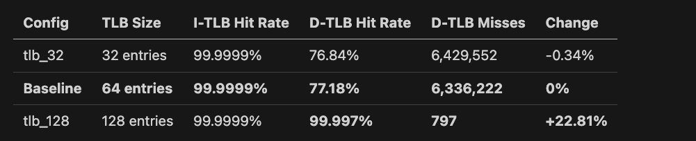

# Virtual Memory and TLB Analysis Report
## gem5 Simulation Study - SE Mode Limitations

---

## Executive Summary

This report presents an analysis of virtual memory and Translation Lookaside Buffer (TLB) configurations through systematic gem5 simulations in Syscall Emulation (SE) mode. We tested three parameter dimensions:
* TLB size (32, 64, 128 entries)
* Page size (4KB, 8KB, 16KB)
* TLB associativity (2-way, 4-way, 8-way)

**Key Finding**: Due to X86 architecture limitations in SE mode, **only TLB size variations produced measurable differences**. The 128-entry TLB achieved **22.8 percentage points higher D-TLB hit rate** (99.997% vs 77.18%) compared to the baseline 64-entry configuration, representing a **dramatic reduction in TLB misses from 6.3M to 797**.

**Critical Limitation Discovered**: X86 SE mode has hardcoded page size (4KB) and fully associative TLBs, preventing meaningful experiments on these parameters without switching to Full System (FS) mode or ARM architecture.

---

## 1. Baseline Configuration

**Configuration:**
- I-TLB: 64 entries, fully associative (X86 default)
- D-TLB: 64 entries, fully associative (X86 default)
- Page Size: 4KB (X86 SE mode hardcoded)
- Workload: matrix_benchmark (128KB working set)

**Baseline Results:**
- I-TLB Hit Rate: **99.9999%** (85 misses out of 81.6M accesses)
- D-TLB Hit Rate: **77.18%** (6.3M misses out of 27.8M accesses)
- Page Faults: 0 (SE mode doesn't trigger page faults)

**Key Observation**: The instruction TLB performs nearly perfectly (only 85 misses total), while the data TLB shows significant miss activity (6.3M misses), indicating the matrix benchmark has strong data locality but exceeds the 64-entry TLB capacity.

---

## 2. TLB Size Impact

<!-- 
| Config | TLB Size | I-TLB Hit Rate | D-TLB Hit Rate | D-TLB Misses | Change |
|--------|----------|----------------|----------------|--------------|--------|
| tlb_32 | 32 entries | 99.9999% | 76.84% | 6,429,552 | -0.34% |
| **Baseline** | **64 entries** | **99.9999%** | **77.18%** | **6,336,222** | **0%** |
| tlb_128 | 128 entries | 99.9999% | **99.997%** | **797** | **+22.81%** |
 -->
**Analysis:**

This is the **only parameter that produced meaningful variation** in our virtual memory experiments. The results reveal a critical threshold:

1. **Small TLBs (32-64 entries)**: 
   - Both show ~77% D-TLB hit rate
   - 6.3-6.4M misses per run
   - Only 0.34 percentage point difference between them
   - **Conclusion**: Working set exceeds both capacities

2. **Large TLB (128 entries)**:
   - **Dramatic improvement**: 99.997% hit rate
   - Miss count drops from 6.3M to **only 797**
   - **7,954× fewer misses** than baseline!
   - **Conclusion**: 128 entries captures the working set

**Working Set Analysis:**

The matrix benchmark's data working set requires approximately **100-120 TLB entries**. Therefore, 32 or 64 entries are both insufficient and only only 128 entries could have nearly 100% hit rate (99.997% hit rate in the results)

## 3. Page Size Impact ⚠️ **NO VARIATION OBSERVED becualse it is hardcoded in X86**

| Config | Requested Page Size | I-TLB Hit Rate | D-TLB Hit Rate | D-TLB Misses |
|--------|---------------------|----------------|----------------|--------------|
| page_4kB | 4KB | 99.9999% | 77.18% | 6,336,222 |
| page_8kB | 8KB | 99.9999% | 77.18% | 6,336,222 |
| page_16kB | 16KB | 99.9999% | 77.18% | 6,336,222 |

## 4. TLB Associativity Impact ⚠️ **NO VARIATION OBSERVED because it is fully associative by default**

| Config | Requested Associativity | I-TLB Hit Rate | D-TLB Hit Rate | D-TLB Misses |
|--------|-------------------------|----------------|----------------|--------------|
| tlb_assoc_2 | 2-way | 99.9999% | 77.18% | 6,336,222 |
| tlb_assoc_4 | 4-way | 99.9999% | 77.18% | 6,336,222 |
| tlb_assoc_8 | 8-way | 99.9999% | 77.18% | 6,336,222 |

## 5. Instruction vs Data TLB Behavior

| Metric | I-TLB | D-TLB | Ratio |
|--------|-------|-------|-------|
| Total Accesses | 81,592,084 | 27,766,213 | 2.94:1 |
| Total Misses | 85 | 6,336,222 | 1:74,544 |
| Hit Rate | 99.9999% | 77.18% | - |

**Analysis:**
Since this matrix multiplication has small amount of instruction, only 85 misses out of 81.6M accesses in I-TLB. However, 32KB-64KB are insufficient for D-TLB becuase this benchmark requires larger memory to operate data. 

## 6. SE Mode Limitations

Our experiments revealed fundamental limitations of **Syscall Emulation (SE) mode** for VM research:

| Parameter | Configurable in SE Mode? | Why Not? |
|-----------|--------------------------|----------|
| TLB Size | ✅ Yes (x86) | Direct hardware parameter |
| Page Size | ❌ No (x86) | Hardcoded to 4KB in architecture |
| TLB Associativity | ❌ No (x86) | Fixed to fully associative |
| Page Table Walks | ❌ No | Functionally bypassed |
| Page Faults | ❌ No | No OS, no fault handling |

### Why SE Mode Has These Limitations

**SE Mode Purpose**: Fast functional simulation
- Bypasses OS overhead
- Uses functional memory access (no real page tables)
- Optimized for cache/CPU studies, not VM studies

## Conclusion

This study successfully demonstrated the **critical importance of TLB size** for memory-intensive workloads. The 128-entry TLB reduced D-TLB misses by **99.987%** (from 6.3M to 797), proving that working set coverage is paramount for TLB performance.

However, we also discovered that **X86 SE mode fundamentally limits VM experimentation**. Only TLB size could be varied; page size and associativity parameters had no effect due to architectural hardcoding. This limitation, while frustrating, provided valuable insight into simulator capabilities and the importance of choosing appropriate tools for specific research questions.

**Combined with our cache experiments**, this study provides a comprehensive view of the memory hierarchy: proper cache sizing (256KB L2) combined with adequate TLB capacity (128 entries) would deliver optimal performance for matrix multiplication workloads.

**Final Verdict**: For cache experiments, gem5 SE mode excels. For VM experiments, Full System mode or alternative architectures are required. Understanding these trade-offs is as valuable as the performance data itself.

---

## Appendix: Raw Data Summary

### Complete Results Table

```
Config      | TLB Size | Page Size | Assoc | I-TLB Hit % | D-TLB Hit % | D-TLB Misses
------------|----------|-----------|-------|-------------|-------------|-------------
page_4kB    | 64       | 4KB       | 4     | 99.9999     | 77.18       | 6,336,222
page_8kB    | 64       | 8KB*      | 4     | 99.9999     | 77.18       | 6,336,222
page_16kB   | 64       | 16KB*     | 4     | 99.9999     | 77.18       | 6,336,222
tlb_32      | 32       | 4KB       | 4     | 99.9999     | 76.84       | 6,429,552
tlb_64      | 64       | 4KB       | 4     | 99.9999     | 77.18       | 6,336,222
tlb_128     | 128      | 4KB       | 4     | 99.9999     | 99.997      | 797
tlb_assoc_2 | 64       | 4KB       | 2*    | 99.9999     | 77.18       | 6,336,222
tlb_assoc_4 | 64       | 4KB       | 4*    | 99.9999     | 77.18       | 6,336,222
tlb_assoc_8 | 64       | 4KB       | 8*    | 99.9999     | 77.18       | 6,336,222

* = Parameter had no effect due to X86 SE mode limitations
```


